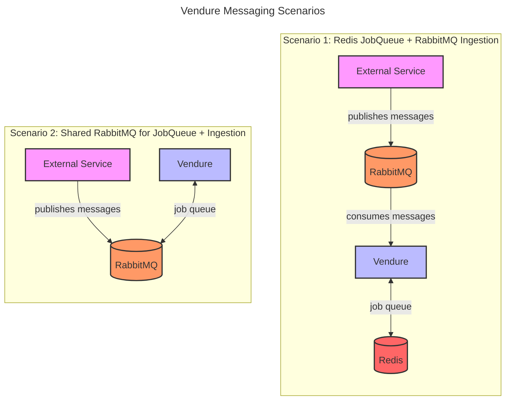

# Vendure Messaging Scenarios

```mermaid
---
title: Vendure Messaging Scenarios
---
flowchart TB
    subgraph "Scenario 1: Redis JobQueue + RabbitMQ Ingestion"
        direction TB
        ext1[External Service]
        rb1[(RabbitMQ)]
        vend1[Vendure]
        redis1[(Redis)]

        ext1 -->|publishes messages| rb1
        rb1 -->|consumes messages| vend1
        vend1 <-->|job queue| redis1
    end

    subgraph "Scenario 2: Shared RabbitMQ for JobQueue + Ingestion"
        direction TB
        ext2[External Service]
        rb2[(RabbitMQ)]
        vend2[Vendure]

        ext2 -->|publishes messages| rb2
        vend2 <-->|job queue| rb2
    end

    style ext1 fill:#f9f,stroke:#333,stroke-width:2px
    style ext2 fill:#f9f,stroke:#333,stroke-width:2px
    style vend1 fill:#bbf,stroke:#333,stroke-width:2px
    style vend2 fill:#bbf,stroke:#333,stroke-width:2px
    style rb1 fill:#f96,stroke:#333,stroke-width:2px
    style rb2 fill:#f96,stroke:#333,stroke-width:2px
    style redis1 fill:#f66,stroke:#333,stroke-width:2px
```
